# Machine Learning summary

## 1. The ML landscape

### ML types

| Supervised                             | Unsupervised                   | Reinforcement           |
| -------------------------------------- | ------------------------------ | ----------------------- |
| Labeled data                           | No labels                      | Decision process        |
| Direct feedback                        | No feedback                    | Reward system           |
| Predict outcome/future                 | Find hidden structures in data | Learn series of actions |
| eg: Classification or regression[^1] | eg: Anomaly detection          | eg: alphago             |

[^1]: Regression = predict a target value from sample's feature

### Model based vs instance based learning

| Model-based                                             | Instance-based                                                     |
| ------------------------------------------------------- | ------------------------------------------------------------------ |
| Evaluate a mathematical function on the unseen instance | Measure similarities between unseen instance and training instance |

### Training a model

1. Choose a parameterized model family ($\text{life satisfaction} = \theta_{0} + \theta_{1} \cdot \text{GDP_per_capita}$)
2. Find parameter values that maximize a fitness function or minimize a cost function

**No free lunch**
: There is no model that is guaranteed to work better, a lot of testing must happen to choose and fine-tune the model.

#### Testing and validation


#### Overfitting

Model doesn't generalize enough. It learns your specific training data but underperforms on new data.

Possible cures:

- Use a bigger dataset
- Simplify model
- Reduce the noice in the dataset

#### Underfitting

When the performance is even bad on the training data

Possible cures:

- Increase number of parameters
- Add more features
- Reduce the regularization parameters

### ML workflow


### Problems with bad datasets

**Sampling bias**: Dataset can be non-representative if it has an underrepresented classes.

Garbage in == Garbage out: Bad dataset is guaranteed to lead to a bad (trained) model.

## 2. End-to-end ML project

### Workflow


### Exploratory Data Analysis (EDA)

1. Get an initial feel of the data
1. Visualize and gain insight
1. Prepare the data

#### What to do with missing values

- Remove entry
- **Imputation**: replace by mean, median, 0, ...

#### Categorical attributes

Attributes that can only take a limited number of values (eg: T-shirt sizes)

**one-hot-encoding**: Use on categorical variables to transform them into a format the model can understand.

#### Features scaling

Some extremely big or small features may have an abnormally large impact on the model.
This can be solved by _rescaling_ them using the following techniques:

- **Normalization** (min-max scaling): $x_{norm} = \frac{x - \min(x)}{\max(x) - \min(x)}$
- **Standardization**: $x_{stand} = \frac{x - mean(x)}{\text{standarddeviation}(x)}$

## 3. Classification

Classification always happens by _supervised learning_ models

### Performance Metrics

#### Accuracy

**Accuracy**
: The percentage of predicted labels that corresponds with the ground truth label.

$Accuracy = \frac{TP + TN}{Total}$

#### Confusion Matrix

Columns are predicted labels, rows are true labels

|               | Automobile     | No Automobile  |
| ------------- | -------------- | -------------- |
| **Automobile**    | True Positive  | False Negative |
| **No Automobile** | False Positive | True Negative  |

#### Precision and recall

**Precision**
: Accuracy of the positive predictions: $precision = \frac{TP}{TP+FP}$

Recall
: How many of the actual positives are detected?: $recall = \frac{TP}{TP+FN}$

**When do we want high precision?**

- When false positives are costly (eg: medical predictions, fraud detection). You really don't want falsely flag a condition.
- In imbalanced datasets where the majority class is the negative one.

**When do we want high accuracy?**

- False negatives are costly (eg: cancer detection or nsfw filters)
- Information retrieval: recall helps ensure that all relevant documents or information are retrieved

#### F1 score

It combines the precision and recall of a model into a single metric.

$F_{1} = 2 . \frac{precision \cdot recall}{precision + recall}$

### Binary Classification

**Binary**
: Only two classes.

- **Decision boundary**: hypersurface that partitions underlying vector space into two sets, one for each class.
- **Score/Class Probability**: $\hat{y}(x^{(i)}) = \begin{cases} +1 \quad \text{if}\quad h_{\theta}(x^{(i)}) \geq T \\ -1 \quad \text{if}\quad h_{\theta}(x^{(i)}) < T \end{cases}$   (T = threshold as hyperparam)

#### Choosing a threshold

##### Precision vs Recall (Choosing a threshold)


##### ROC curve and Area Under The Curve (AUC)


### Multiclass classification

#### One-vs-Rest

Turn multiclass into binary classification (eg: classes [green, blue, red] -> one-vs-rest: [green, rest[blue, red]])

- Classification based on voting
- NumClass * (NumClass – 1)/2 classifiers to train

## 4. Training models

### Linear regression

- **Assumption** (Inductive bias): There is a linear relationship between the input features and the target.
- $Price = \theta_{0} + Bedrooms * \theta_{1}$
  - $\theta_{0}$ : intercept Bias
  - $\theta_{1}$ : slope weight
- Goal: find optimal parameter that defines line that best fits the data
- The prediction is the weighted sum of the input features with an additional bias
- $\hat{y} = h_{\theta}(x) = \theta \cdot x$
  - $\hat{y}: prediction$
  - x: input features, extended with a “1” value (as bias)
  - $\theta$: model parameters


#### Linear regression training

- Minimize some loss function that measures how good $\theta$ is (Root Mean Square Error): $RMSE = \sqrt{\sum_{i=1}^{n} \frac{(\hat{y}_{i} - y_{i})^2}{n}}$
- Multiple options to find $\hat{\theta}$
  - Direct “closed form” solution
  - Gradient descent
    - Batch
    - Mini-batch
    - Stochastic

#### Direct solution

- Directly calculate the optimal parameter given a labelled dataset (rare)
- Like generating a trendline in excel
- **Ordinary least squares**
  1. Calculate the partial derivatives of the loss function with respect to the parameters ($\Theta_{0}, \Theta_{1}$)
  2. Set derivatives to zero
  3. Solve the set of equations
- Relies on matrix inversion: $O(n^{3})$


#### Gradient descent

**Gradient descent**
: It is a first-order iterative algorithm for finding a local minimum of a differentiable multivariate function.

- Generic optimization algorithm
- Procedure:
  1. Calculate the partial derivatives of the Loss function with respect to the parameters ($\Theta_{0}, \Theta_{1}$)
  2. Pick random values for ($\Theta_{0}, \Theta_{1}$) and evaluate the partial derivative function. These describe how the loss function changes when you change ($\Theta_{0}, \Theta_{1}$)
  3. Adjust ($\Theta_{0}, \Theta_{1}$) in opposite directions of the gradient
  4. Repeat until convergence
- **Learning rate** determines step size

> Convex vs non-convex optimization problem  
> **Convex**: There is no *local minimum*, only one *global minimum*. Gradient descent guaranteed to find minimum.  
> **Non-convex**: There are *local minima*, meaning that model can easily get stuck on bad model.  


##### Batch Gradient descent

Combination of Batch and Stochastic

Calculate the gradient using all available training data before performing a step

- ✅ You use all data -> great model
- ❌ Very slow for small datasets

##### Stochastic Gradient descent

Loop over all training data, calculate the gradient and take a step for each sample

- ✅ Fast
- ✅ Only uses memory for single sample instead of entire dataset
- ❌ Gradient estimate will be noisy
  - unlikely to find optimal solution
  - randomness might help to escape local minima

##### Mini-batch Gradient descent

Combination of Batch and Stochastic

### Polynomial regression

If the relationship is not linear. (eg: temperature and sales of ice cream. Hot days mean lots of sales, but too hot and eating ice cream becomes inconvenient)

- Fit on non-linear model: $y = f(x) = \Theta_{0} + \Theta_{1}x + \Theta_{2} x^{2}$
- Find ($\Theta_{0}$, $\Theta_{1}$, $\Theta_{2}$) with gradient descent
- Transform data to space where it can be solved with linear model

### Model regularization

There are 3 kinds of **generalization** (make useful predictions on unseen data) errors:

**Bias error**
: Mistakes because of wrong assumptions when designing the model = *underfitting* (eg: assuming linear relations)

**Variance error**
: Mistakes made because the model is very sensitive to small variations in the input = *overfitting*

**Irreducible error**
: Noise in the data

How to regularize a model:

- Limit the models expressive power -> less overfitting -> better generalization
- Add regularization term that forces weights to be small
- **Ridge regression**: Tries to approach a loss of 0
- **Lasso regression**: Tries to reach a loss of 0 (-> **Sparse model**)
- **Elastic net**: Weighted sum of Ridge and LASSO

### Cross validation

If there is too little data to afford splitting into test/train/val, you can reuse a lot of data using cross-validation

1. Split data into K equal folds (K=5 or K=10)
2. Train using folds 1-9
3. Test using fold 10
4. Repeat 10 times with other folds as test set
5. Report average accuracy and standard deviation

- ✅: All data will be used for evaluation
- ❌: Computationally expensive

### Hyper parameter optimization

Automated procedures to find good hyper parameters:

- **Grid search**: From each hyper param, combine some values.
- **Random search**: Randomize hyper prarams

> ⚠️ : Optimizing hyper params is also a form of *overfitting*!

Best practice:

1. Split off test set and do not touch it!
2. Develop your model, optimizing hyper parameters with Random search in combination with cross-validation
3. Retrain your model on all training data using the best hyper parameters
4. Evaluate model on test data

### Classification

Why not use linear regression for classification?

Regression models predict an exact value. Gradient descent will change wights to adjust to latest train data, introducing errors for other data.

#### Logistic and Softmax regression

> ⚠️ : Despite the name, Logistic and Softmax are not regression models

##### Logistic regression

- $\hat{p} = \sigma(0.25 * X_{1} + 0.125 * X_{2} - 1)$
- in general: $\hat{p} = h_{\theta}(x) = \sigma(x^{T} \theta)$
- With $\sigma$ = sigmoid function: $\sigma(t) = \frac{1}{1 + \exp(-t)}$
  - \>0.5 if input is positive
  - <0.5 if input is negative
- p close to 0 or 1: data lies far from decision boundary
- p close to 0.5: data close to decision boundary


Training logistic regression

1. Goal: find optimal parameters $\hat{\theta}$ that defines line that best separates the data.
2. Optimize a cost function
3. Use **Log loss**
4. Train using gradient descent with partial derivatives

##### Softmax regression

- For if there is more than one class
- Predict a probability for each class and normalize them to sum to one using the Softmax
- The model is then trained using gradient descent with the cross entropy loss


## 5. Super Vector Machines: Linear classification

- Objective: Learn discriminating function g(x) that separates samples of two categories.
- Inductive Bias: g(x) is linear in its features (line in 3D, plane in 3D)
  - $g(x) = w_{1}x_{1} + w_{2}x_{2} + b = w \cdot x + b = w^{T}x + b$
    - b = bias term
    - w = direction of discriminating function
  - Decision rule:
    - $w^{T}x + b \geq 0$ -> Sample belongs to class 1
    - $w^{T}x + b < 0$ -> Sample belongs to class 2


### Largest margin classifier

Update decision rule to include margin:

- $g(x) = w^{T}x + b \geq 1$ -> Sample belongs to class 1
- $g(x) = w^{T}x + b \leq -1$ -> Sample belongs to class 2
- Width of street becomes: $\frac{2}{\lVert w \lVert}$
- Margin functions:
  - $g(x_{+}) = w^{T}x_{+} + b = 1$
  - $g(x_{-}) = w^{T}x_{-} + b = -1$

To maximize the street width, we need to minimize $\lVert w \lVert$. For math convenience, we will minimize $\frac{1}{2} \lVert w \lVert ^{2}$


#### Importance of standardization before margin classification

When not standardized, the distance calculation is dominated by the feature with the largest scale, therefor it is necessary to scale/standardize all values using the following formula:
$x_{0, scaled} = \frac{x_{0} - \mu_{x_{0}}}{\sigma_{x_{0}}}$

### Soft margin classification

Allows for:
- misclassification (can deal with outliers)
- items in the margin

Tolerates some errors: $\zeta^{(i)} \geq 0$

$g(x^{i}) = t^{(i)}(w^{T}x^{(i)} + b) \geq 1 - \zeta^{(i)}$


### Hard margin vs soft margin

| Hard          | Soft          |
|---------------| ------------- |
| small margin  | bigger margin |
| more accurate | less accurate |

### Solving SVM's

$w = \sum_{i=1}^{n} \alpha^{(i)}\,t^{(i)}\,x^{(i)} = \sum_{x^{(i)}} \alpha^{(i)}\,t^{(i)}\,x^{(i)} + \sum_{x^{(i)}} C\,t^{(i)}\,x^{(i)}$

Meaning: w = on the margin + in-margin or misclassified

- $\alpha^{(i)} = 0$: if $x^{(i)}$ is on the correct side of the boundary and outside margin
- $\alpha^{(i)} = C$: if $x^{(i)}$ is on the wrong side of the boundary or within the margin
- $0 < \alpha^{(i)} < C$: if $x^{(i)}$ is exactly on the margin

### SVM for non-linear classification

Example of non-linear data


#### The kernel trick 

It is possible to project data to higher dimension, and solve using linear classification.

> ❗: Due to hidden constants, the complexity of the solver scales badly with the number of features, so the generalized Lagrangian is no longer that efficient.

## 6. Decision Trees

Break down a decision on a sequence of smaller decisions, each based on a single feature.

Example:

```text
X1 = Age
X2 = Sex
X3 = Cholesterol

Y = Patient has heart disease

-> Age > 60?
        ├ yes -> Cholesterol > 300?
        │                ├ yes  -> Y = 1
        │                └ No   -> Y = 0
        └ No -> Sex = Male?
                         ├ yes  -> ...
                         └ No   -> Y = 0
```

### Decision trees for classification vs regression

| Classification                                             | Regression                                              |
|------------------------------------------------------------|---------------------------------------------------------|
| Predict class members                                      |  Predict continuous value                               |
| Leaves store class probabilities                           | Leaves store values                                     |
| Internal nodes define a split of the remaining data points | All items in the smae subspace have the same prediction |

### Building a decision tree

1. Given a dataset with features X and labels Y, split data in two by asking questions
2. Question = compare one feature with a threshold
3. Iteratively split two subsets again by asking another question
4. Repeat until no data left or tree has certain hight

### CART (classification and regression trees) algorithm

> ❗: High probability for a practical question on the exam!

1. Loop over all features
2. Pick a threshold
3. Split data points in two based on this threshold
4. Measure how good split is with a **cost function**
5. Pick best split
6. Repeat until split is empty or until tree height is reached

Cost function: $J(k, t_{k}) = \frac{m_{left}}{m}\,G_{left} + \frac{m_{right}}{m}\,G_{right}$

* G = cost (Gini impurity)
* k = different classes
* $t_{k}$ = Node
* m = total number of instances in a node before the split

Gini impurity = $1-\sum_{i=1}^{C}(p_{i})^{2}$

* C = number of classes
* $p_{i}$ = fraction of data points that belong to class C in the subset

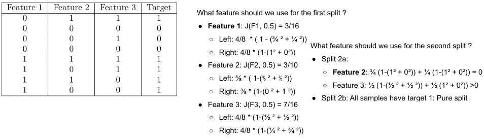

#### Entropy

Instead of the *Gini impurity* we can also use Entropy

**Entropy**
: Average level of "information", inherent to the variable's possible outcome

In decision tree, entropy is zero if a particular node only contains samples of a single class.


### Regularization

Decision trees, too, can overfit. Therefor regularization is important. It limits the freedom of:

- Min_samples_leaf
- Min_weight_fraction_leaf
- Max_height
- Max_leaf_node


### Are decision trees any good?

- ✅: Easy to understand
- ✅: Can model non-linear data
- ✅: Whitebox model (eg: useful for medical prediction to know what influenced the diagnosis prediction)
- ✅: Easy to implement
- ✅: Allows to determine feature importance
- ✅: Supports multiple outputs
- ❌: Unstable (small change in data can drastically change model)
- ❌: All decisions are made by orthogonal decision boundaries (only straight lines perpendicular to feature axis)
- ❌: Relatively inaccurate
- ❌: Prone to overfitting

## 7. Ensembles

- Combine many weak models into one strong model.

Procedure:

1. Make sure all models learn different things
2. Combine individual predictions

Different techniques: Voting, Boosting and Stacking

> 💡: Decision trees are a good candidate for ensembles, because they can completely change if the data changes a bit. This is a good quality for ensembles.

### Voting

Train models on slightly different datasets and combine them using average or voting

Methods to make different versions:

- **Bagging**: sample from the dataset with replacement
- **Pasting**: sample without replacement
- **Random subspaces**: use different subsets of the features
- **Random patches**: select both random data points and random feature subsets

### Boosting

Train different models that correct each other's mistakes. 

Unlike voting, training is sequential and can not be performed in parallel.

#### Adaboost

Each sequential model focuses more on the data points that had incorrect predictions for previous models

- Two types of weights:
  - **Instance weight** $w^{(i)}$: Weight of each sample, focuses on samples that were misclassified by the previous models
  - **Predictor weight** $\alpha^{(i)}$: Weight of each model, used to calculate the final prediction

1. Initialize every weight to 1/m
2. Train the model (calculate its weighted error rate)
3. Calculate the predictor weight
4. Update the instance weights and normalize them 
5. Repeat 2-4 until max number of predictors is reached or sufficient performance
6. Calculate weighted prediction of the different models

#### Gradient boost

Each sequential model tries to predict the residual error of the previous models.

- The next predictor tries to predict the **residual error** made by previous predictors
- Final output is the sum of the predictions of the individual models

### Stacking

Train a model using predictions of other models as input. Meaning that the model will combine predictions of other models.

1. Split train set in two
2. Train different models on the first part
3. Extract the predictions of the models for the second part = **Blending data set**
4. Train a model on the predictions of the first models


## 8. Dimensionality Reduction

Every data point is a point in an n-dimensional space.

### Curse of dimensionality

As the amount of features (= dimensions) grows, the amount of data we need te generalize grows exponentially.

- *Data becomes sparser: instances are further from each other in higher dimensions*
- *Distance loses its meaning*: all points become equally far away from a given point

**Manifold hypothesis**
: The hypothesis dictates that data is actually lower dimensional than the original input space. (Therefor, we should be able to reduce dimensions and preserve accurate data)

Approaches to dimensionality reduction:

- **Feature selection**: Only keep the useful features
- **Feature projection**: Apply transformation and projections to derive new features

### Linear dimensionality reduction

Dimensionality reduction on linear data.

#### Principal Component Analysis (PCA): geometric interpretation

Procedure:

1. Minimize projection error is equal to maximizing the variance of the projected data
2. Find direction of largest variance in data (eigenvector with largest eigenvalue) (1st principal component)
3. Find direction of remaining largest variance, orthogonal to 1st principal components (2nd principal component)
4. etc...

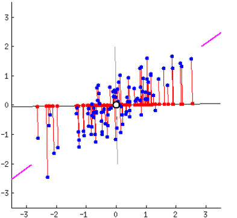


**How to find the optimal components?**
 
Calculate the normalized eigenvectors of the covariancematrix. (matrix that displays the covariance between every pair of variables in a dataset)

1. The eigenvector `v` of a matrix `A` are the vectors `v` such that if you multiply `A` with `v`, you get a multiple of `v`
2. The vector still points in the same direction but has different length
3. The scalar `λ` is called the eigenvalue that belongs to `v`.

**Covariance**: $\sigma(x_{1}, x_{2}) = \frac{1}{m-1} \sum_{i=1}^{m}(x_{1}^{(i)} - \overline{x_{1}})\,(x_{2}^{(i)} - \overline{x_{2}})$


Covariance Matrix: $M = U \cdot \sum \cdot V^{*}$

- M = covariance matrix
- U = orthogonal matrix representing the left singular vectors
- $\sum$ = diagonal matrix with singular values on the diagonal
- V = columns of vector V contain **unit vectors** corresponding with principal components

#### PCA steps

1. Center-mean the dataset
2. Compute eigenvectors and the corresponding eigenvalues of the covariance matrix (via SVD (Singular Value Decomposition))
3. Sort the eigenvectors by decreasing eigenvalues
4. Select the eigenvectors of the d largest eigenvalues
5. Form an `n x d` matrix `W` containing the second eigenvectors as columns
6. Use eigenvector matrix to transform the samples onto the new subspace

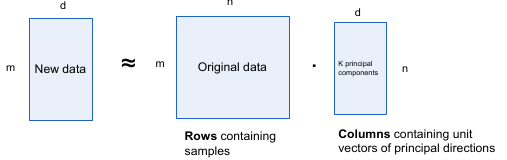


> ❗: Make exercises on slides 25 and 26!


### Non-linear dimensionality reduction

One technique to transform data to linear data is to use **Linear Local Embedding**. In this technique, you preserve the original relative distance to near neighbours in the reduced space (Reduced dimension).

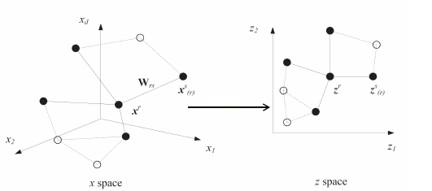

## 9. Unsupervised learning

### Distance-based algo

- Goal: Find a group of similar instances
- Clustering algo assigns a cluster number to each sample
- **Unsupervised**: There is no ground truth to evaluate the performance of the algorithm

#### K-means clustering

Strategy:

1. You want to make `k` clusters (desired number of classes)
2. Randomly select `k` points from the dataset as initial cluster centroids $C^(1),\ldots C^(k)$
3. For each data point ($x^{(i)}$) in the dataset, calculate its distance to each centroid. Assign the data point to the nearest centroid: $b^{(i, j)} = \begin{cases} 1 & \text{if} \quad j = argmin \sum_{l=i}^{m} (x_{l}^{(i)} - C_{l}^{(k)})^{2} \\ 0 \end{cases}$
4. Calculate new values for centroids: $C_{new}^{(k)} = \frac{\sum_{i=1}^{m} b^{(i,k)} x^{(i)}}{\sum_{i=1}^{m} b^{(i,k)}}$
5. Repeat 3-4 until convergence criteria are met

> 💡: Possible stop criteria: length of cluster center shift, # iteration, ...

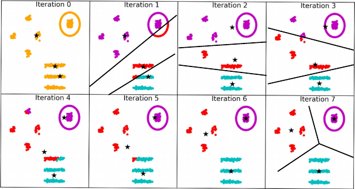

**Problem**
: If initial randomly selected centroids are bad, it may never find the right clusters. 

**Solution**
: Restart the k-means algo x-times and pick the clustering with the lowest **inertia** (= mean average distance of each point to its closest centroid)

- ❌: cannot deal with difference in density between clusters
  - **Variance** of features must be similar for all clusters

##### Finding the right number of clusters: inertia

1. `k` as hyperparam
2. run k-mean algo for different values of `k`
3. Compare results, the lower *inertia*, the better

inertia = $\frac{1}{m} \min || x^{(i)} - C^{j} ||^{2}$

> ⚠️: Too many clusters might lead to overfitting

##### Silhouette score

The **silhouette score** is a measure used to evaluate the quality of clustering in a dataset. It provides an indication of how well-separated the clusters are. This score ranges from -1 to 1, where:

- close to +1: the sample is far away from neighboring clusters, indicating good separation.
- close to 0: the sample is close to the decision boundary between two neighboring clusters.
- close to -1: sample might have been assigned to the wrong cluster.

$s^{(i)} = \frac{b^{(i)}-a^{(i)}}{\max (a^{(i)},b^{(i)})}$

- $a^{(i)}$: mean distance from point to all other points in same cluster
- $b^{(i)}$: mean distance from point to all instances in the next closest cluster

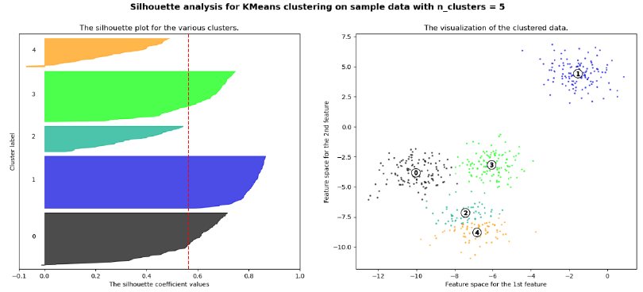

#### DBScan clustering

*Density-Based Spatial Clustering of Applications with Noise* is a clustering algorithm particularly effective at identifying clusters of arbitrary shapes and handling noise in the data.

**Core instance**: point with least `minPts` within distance $\epsilon$

1. Pick a random point `p`
2. init a new cluster
3. inspect `p`
    - if `p` is not core: consider as noise
    - if `p` is core:
      - add all points within distance $\epsilon$ to cluster
      - recursively inspect all point in neighbourhood
4. Sample new unclustered point and repeat

- ✅: no need to manually select number of clusters
- ✅: find clusters of arbitrary shape
- ✅: works well when clusters are dense enough and well-separated by low-density regions
- ❌: not deterministic
- ❌: uses distance metric (beware of scaling and *curse of dim reduction*)
- ❌: difficult to choose right hyperparam

#### Hierarchical clustering

Cluster data into a hierarchy of groups or clusters. It doesn't require specifying the number of clusters beforehand.

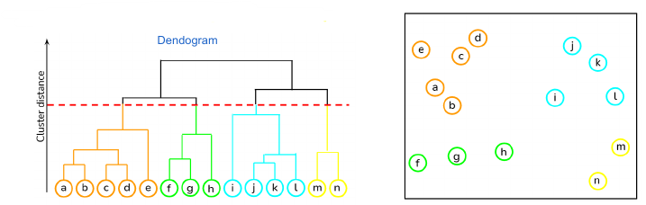

Hyperparams:

- **Affinity**: distance metric between points
- **Linkage function**: distance between clusters
  - complete linkage: max distance between elements of different clusters
  - single linkage: min distance between elements of different clusters

### Probability-density based (density estimation): Gaussian Mixture Model

#### Generative modelling

A ML technique used to create models that can generate new data similar to a given dataset. This is commonly used for image or text generation.

**Inductive bias**: instances in dataset are samples form *unknown statistical distribution* over a feature space: $x^{(i)} \sim P_{data}(x)$

**Task**: learn from the data a *probability density function* that matches this unknown distribution: $P_{model}(x) \approx P_{data}(x)$

#### Distribution family

**Inductive bias**: data is sampled from a member of a particular *distribution family*: $P_{model}(x) = P_{model}(x;\theta)$

**Task**: find the "best" values for the parameter vector $\theta$ which we denote as $\theta^{*}$


#### Use cases for generative models

- **Anomaly detection**: if $P_{model}(x_{new}; \theta*)$ is lower than threshold -> anomaly
  - 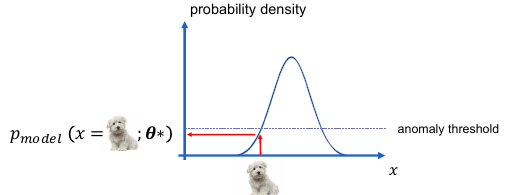
- **Classification**: generate a new sample with the features of the new data and add a feature that represents a class. Do this for every class and then compare the probabilities. $P_{model}(x_{1,new}, x_{2, new}, y = 1, \theta*) \gg P_{model}(x_{1,new}, x_{2, new}, y = 2, \theta*)$
  - Where `x1` and `x2` are features form the data and `y` is the class
- **Generating new samples**
  - 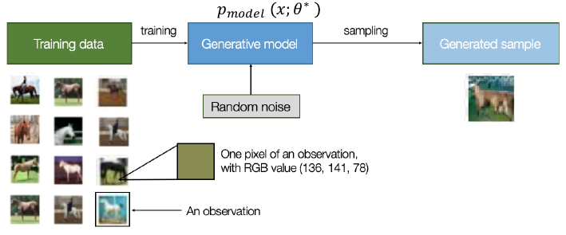

#### How to sample from a distribution?

1. Make inverse cumulative distribution function
2. Sample a random number in [0, 1[ (CDF(x) = $x_{new}$)


### Density estimation: Maximum likelihood

**Inductive bias**: universal Gaussian distribution

**Task**: find "best" values for $\theta = [\mu, \sigma]$

#### Likelihood function (to find best distribution)

Every item `x` in our dataset is a sample of an unknown distribution $P_{data}(x)$. We assume that this distribution is a member of a family of distributions $P_{model}(x;\theta)$. The best model should maximize the **joint probability** of all items $x^{(i)}$.

$$P_{model}(x^{(1)},\ldots,x^{(m)}; \theta) = \prod_{i=1}^{m} P_{model}(x^{(i)};\theta) = \mathcal{L}(\theta)$$

> ❗: High probability for a practical question on the exam!


#### Negative Loglikelihood estimation

Often used to find the minimal loss function.


### Soft clustering: Gaussian Mixture Distribution

What if there are multiple groups in a dataset? For example a dataset of dog pictures, these can be categorized in groups by dog-race.

#### Multimodel distribution

Here, data is distributed as sum of multiple Gausssian distributions. Note: this sum gets *downscaled* to maintain a surface of `1`.


#### Gaussian Mixture Model (GMM)

$$P_{model}(x;\theta) = \sum_{i=1}^{k} \phi_{i} \mathcal{N}(x;\mu_{i},\sigma_{i})$$

In this formula, $\phi$ is the factor with which to *rescale* the individual distributions to maintain a valid density function (surface = 1).

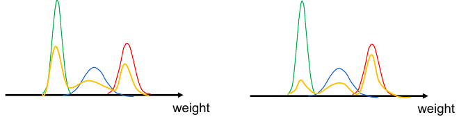

#### MLE of Gaussian Mixture Model

The MLE (Maximum Likelihood Estimation) of a GMM involves finding the parameters ($\mu,\sigma$) that best fit the observed data under the assumption that the data comes from a mixture of Gaussian distributions.

However, data under GMM doesn't have a closed mathematical solution so we can't maximize the likelihood function with concepts like gradient descent. Instead, we use our prior knowledge (inductive bias)

1. If we know which source or component generated each data point (x), we can estimate the parameters of $\mu$ and $\sigma$ by fitting a Gaussian distribution.
2. If we know the means and variances, we can calculate the likelihood of each data source to have generated x.

#### Soft labeling

We can label data by comparing the confidences ($\mathcal{N}(x;\mu_{i},\sigma_{i})$) of data to a certain GMM component.


#### Expection-Maximization algorithm (EM)

1. Calculate soft-labels based on current distribution params (expectation step)
2. Update distribution params (maximization step)
3. Repeat

#### Soft Clustering

In contrast to *k-means* clustering, where the model decides which group a sample belongs to. We can quantify the likelihood a sample belongs to a particular group by soft clustering the data.

Process:

1. Identify the number of clusters you want to split the data into.
2. Define each cluster by generating it a Gaussian model.
3. For every sample, calculate the probability it belongs to a certain cluster.
4. Recalculate the Gaussian models using the above probabilities.
5. Repeat until high set of probabilities.

### multivariate GMM

#### Multivariate unimodel Gaussian

A multi-dimensional Gaussian distribution (multivariate) that has a single peak or mode. It's a type of multivariate Gaussian distribution where the data tends to cluster around a single central point


$$p(x) = p(x_{1},\ldots,x_{n}) = \mathcal{N}(x;\mu,\Sigma)$$

Where:

- $\mu = [\mu_{x} \; \mu_{y}]$
- $\Sigma = \begin{pmatrix} \sigma_{x}^{2} &\rho\sigma_{x}\sigma_{y} \\ \rho\sigma_{x}\sigma_{y} &\sigma_{y}^{2} \end{pmatrix}$

#### Multivariate multimodel Gaussian

A multi-dimensional Gaussian distribution (multivariate) that has multiple peaks. For example, a dataset of dogs. Every dog in that distribution has its own multivariate unimodel Gaussian distribution (eg height x wight).

$$p(x) = \sum_{i=1}^{k} \phi_{i} \mathcal{N}(x;\mu_{i},\Sigma_{i})$$

Where:

- $\mu_{i} = [\mu_{ix} \; \mu_{iy}]$
- $\Sigma_{i} = \begin{pmatrix} \sigma_{ix_{1}}^{2} &\rho_{i}\sigma_{1x_{1}}\sigma_{1x_{2}} \\ \rho_{i}\sigma_{ix_{1}}\sigma_{ix_{2}} &\sigma_{ix_{2}}^{2} \end{pmatrix}$


#### MLE result can be used for clustering


---

## 10. Introduction to Artificial Neural Networks with Keras

### 10.1 Wave 1: Perceptron

**Perceptron**
: Single-layer NN that aims to solve binary classification problems.

**Different components**:

- Inputs
- Weights
- Weighted sum
- Step function


Weights get updated using the following formula:

$$w_{i,j}^{(next\,step)} = w_{i,j} + \eta(y_{j} - \hat{y}_{j})x_{i}$$

- $w_{i,j}^{next\,step}$: Next weight value
- $w_{i,j}$: Old weight
- $\eta$: learning rate (constant that determines the step size)
- $y_{j} - \hat{y}_{j}$: target - prediction (binary value)
- $x_{i}$: input value

The problem with the perceptron is that it is only capable of making linear decision boundaries. (Not even able to solve an XOR).

### 10.2 Wave 2: Distributed representations

The concept of **connectionism** got tracktion: Every input should be represented by different features. Every feature should be involved in the representation of the many inputs.

**Multi layered perceptrons** (MLP) also got discovered. These added layers allowed backpropagation to happen -> non-linear classification boundaries.

### 10.3 Wave 3: Deep learning

Because of the better hardware, we were able to make deep neural networks. And train them with more readily available data. A deep neural network consists of multiple stacked layers of neurons, typically trained using backpropagation (gradient descent).


**"Deep"** refers to the fact that the model is able to extract features from raw information instead of having humans extract the manually.

**Logistic Regression**: simple neural network:

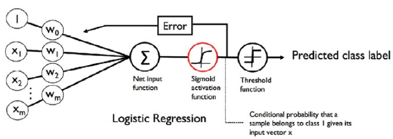

#### Activation functions

By default, each layer calculates a linear combination of the outputs of the previous layer. By adding non-linear activations, we can make the network behave in a non-linear way. (most common: ReLU)


#### Neural network training

There is no closed solution to finding the minimal loss as the loss function is *non-convex*. Instead we rely on **gradient descent** which is not guaranteed to find the global minima.

**Backpropagation**
:Algorithm to calculate the gradient with respect to the parameters of hidden layers.

#### Neural networks for unsupervised learning / dimensionality reduction

- **Autoencoder**: model trained to reconstruct its own input
- Autoencoder has a **bottleneck** between the encoder and decoder, effectively compressing the data.
- After compressing, a **decoder** tries to reconstruct it to original state
- If there was no correlation between data this would not work.
- If there is correlation, that structure can be learned

Autoencoders are used for:

- Dimensionality reduction: discard decoder after training
- Anomaly detection: reconstruction error is anomaly metric
- Unsupervised pretraining

Neural networks have many hyperparams that need to get configured:

- Num of layers
- Num of neurons/layer
- Activation function
- Learning rate & batch size
- Training algo and loss function
- Initialization of params
- Noise and data augmentation
- Regularization

---

## 11. Training Deep Neural Networks

### Vanishing / exploding gradients

By stacking multiple layers with sigmoid activations, the gradients become very small for the first layers (**Vanishing gradients**) and wont change much despite not being trained good.

Situation:

1. Gradients are propagated backward through layers, they get multiplied by weight matrices and activation functions' derivatives.
2. Activation functions have regions where their derivatives become very small ($\approx 0$)
3. The deeper the gradient traverses in the network, the effect of small gradients gets compounded until it effectively "vanishes".

#### Solution 1: Weight initialization

The distribution of the initial weight factors can have a big impact on the model training. It is best to give every weight an initial ±random value. A common strategy is to assign a weight a value from a normal distribution.

#### Solution 2: Activation functions

> ⚠️: Sigmoid activation functions are not the best choice because of **saturation**. Saturation occurs because the activation function squashes the input values to a number in the range of [0, 1]. Extreme input values (small or large) get a value close to 0 or 1 and the gradient becomes very small.

To avoid saturation, the use of the ReLU (Rectified Linear Units) activation function, or one of its derivatives, is preferred. (ReLU returns the value itself if it is bigger than 0)

#### Solution 3: Batchnorm

- Additional layers after neural network layers
- Normalizes the activations by subtracting a mean and dividing by the standard deviation of the activations across the batch during training
- Keeps track of a moving average of these statistics to be used for inference.
- It is supposed to reduce "internal covariate shift", but it is not quite understood how or why this happens.

### Optimization algorithms

There are some algorithms that can perform better than mini-batch gradient.

- **Momentum**: Use previous gradient to keep track of the direction (faster and can escape local min/max)
- **Adaptive learning rate**: Algo that automatically uses different learning rate for different parameter
- **Second order method**: Use second order partial derivatives to estimate curvature around a point (expensive but gives more insight in how far you are from optimum)

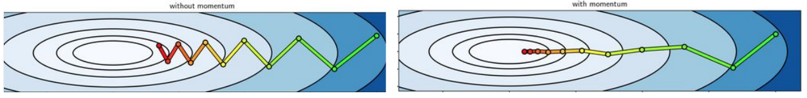

### Learning rate scheduling

💡: Learning rate determines the size of the step the model takes when searching for minimum. It is perhaps the most important hyper parameter to tune. A good strategy is to start with a high learning rate and decrease it overtime (decay).

### Regularization

Regularization limits the freedom of the model. If you let the model learn to much, it becomes prone to overfitting.

A couple regularization techniques:

- Use more training data
- Use data augmentation and randomness
- L1 and L2 regularization
- Dropouts
  - Randomly set some nodes to zero during training
  - This increases robustness
  - Forces each neuron to be more independent

### Normalization

Normalization is the process of scaling and transforming the input features to a standard scale. The goal is to bring all features to a similar scale, preventing certain features from dominating the learning process simply because they have larger magnitudes.

Techniques:

- Min-max normalization: Scale to [0, 1]
- Zero-center: subtract mean
- Standardize: subtract mean, divide by standard deviation

### Hyper parameter tuning

This can be done manually ("grad student descent") or automatically (grid search, random search, ...).

A good general approach:

- Use simple model without generalization
- Sanity check the loss
- Overfit on a small subset of the data
  - try different models
  - try different learning rates
- Train the most promising models on the full dataset for a few epochs, try different optimizers
- Apply regularization and train on the full dataset

---

## 14. Deep Computer vision using convolutional neural networks

When working with input data with higher dimensions (like images), traditional neural networks face some problems.

Lets take an image for example (200x200x3), first of all, this data has to get reshaped to 1D (flatten).

- **Problem 1**: The model needs to learn that certain inputs are related
- **Problem 2**: 120000 input nodes + hidden layers make for a very large neural network (consumes a lot of memory and is less efficient to train)

### Convolutional neural networks

(CNN's) are designed to solve these problems.

- Inputs are kept in 2D or even 3D (the *convolutional layers* also keep these dimensions)
- Not all neurons are connected to all neurons from previous layer. Instead, every neuron is connected to some patches (e.g. 3x3) of neurons from the previous layer
- **Hierarchical structure**
  - First layer (most nodes) focuses on small low-level features
  - Deeper layers assemble these into higher level features
- **Weights are reused**
  - All neurons on the same layer use the same weights
  - These weights define a **kernel** (filter) that slide over the input
  
  By **convolving** the inputs with a suitable kernel, we obtain a filtered version of the image or a **feature map**. Depending on the kernel, it is also possible to learn **spatial** features (like horizontal vs vertical lines or certain color transitions). A single layers applies N filters and thus generates N feature maps. The weights of these filters are determined using gradient descent.
  


#### Convolutional layer output size

The output size is determinded by the size of the kernel and the **stride** (step between the places the filter is applied)

$$n_{out} = \lfloor \frac{n_{in} + 2p - k}{s} \rfloor + 1$$

- $n_{in}$: num of input features
- $n_{out}$: num of output features
- `k`: conv kernel size
- `p`: conv padding size (sometimes **zero padding** is applied so that every value of the input is taken into account)
- `s`: conv stride size

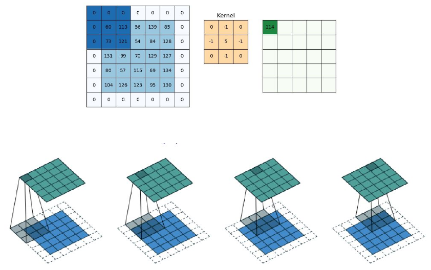

#### Convolutional layer number of parameters

number of parameters = Number of kernels * kernel size + number of kernels (bias term)

### Pooling

After performing a convolution, the feature maps can still be quite large. A solution to this is to subsampel the features from the feature maps. In **max pooling** this is done by dividing the feature maps into slices. For every slice, only the most dominant (max) value is kept. The result is a feature map with with the same resolution as the number of slices. It is also possible to pool in strides.

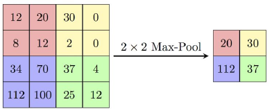

$$W_{out} = \frac{W - F}{S} + 1$$

- $W_{out}$ = output width/height
- `W` = input width/height
- `F` = pool size
- `S` = pool stride


- ✅: Reduce memory required
- ✅: Reduce computational cost
- ✅: Allow next layer to have larger receptive field
- ✅: Improve invariance to small translations of the input
- ❌: Some loss of information

### CNN architecture

The final network is obtained by stacking

- Conv layers
- Non-linear activations
- (opt) batchnorm
- Pooling
 
To perform classification, the model is typically followed by:

- flatten
- fully connected layer
- activation function (softmax)

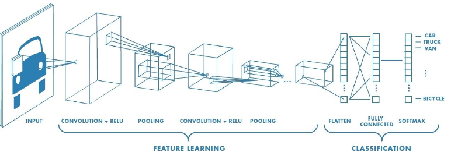


#### Data augmentation

For CNN, a common technique is to artificially increase the size of the training set bet generating variants of existing training instances (rotate, flip, blur, crop, ...). This often reduces overfitting.

---

## 15. Processing Sequences using RNNs and CNNs

**Recurrent Neural Networks**
: NNs with neurons that have connections (weights) that point backwards. This characteristic is desirable when working with sequential data like time series prediction, speech recognition, NLP, video analysis, ...

The output of a step `t` is given together with the input at step `t+1`

$$y_{t} = \phi(W_{x}x_{(t)} + W_{y}y_{(t-1)} + b)$$


### RNN architectures

There are a couple different RNN architectures

#### Seq2seq

For when both input and output are sequential. A use case of this could be text-to-speech conversion.

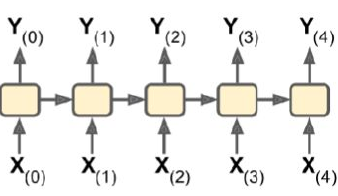

#### Seq2vec

Input is sequential, but output is a fixed-size vector. A use case for this could be sentimental analysis, or a speech-recognition tool that has to understand only "hey google".

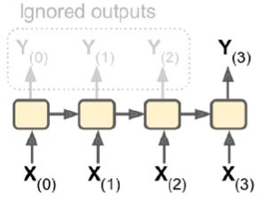

#### Vec2seq

For when the input is a fixed-size vector, but the output needs to be sequential. A use case for this could be image captioning; a model gets an image as input and has to describe it.

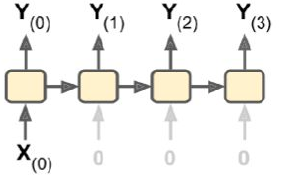

#### Encoder-decoder

A combination of Seq2vec and Vec2seq, it serves as an alternative for Seq2seq. 
A use case for this could be a language translation model the translation system needs more than just one world, as the word could be different depending on the context. 

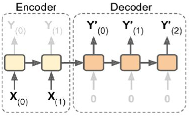

### Backpropagation through time

To train an RNN, we unfold the network over time and train it like a feed forward model.

Since the output of a neuron at a certain time step is a function of all the inputs at previous time steps, a neuron in an RNN is also called a **memory cell** (it preserves state)


RNNs are known to have some issues during trraining:

- RNNs are slow and unstable (especially for long sequences)
- **Saturation**: the same weights are used in every step, we need to make sure that the output does not keep increasing.
 
### Long-Short Term Memory (LSTMs)

RNNs output depends on the input of all previous timesteps, but for long sequences, RNNs tend to forget the first inputs. That is why LSTM models *explicitly define a memory slot*.

- Two memories:
  - Short term (preivious outputs)
  - Long term
- Model decides what to store in long term
- output is based on input and both memories


> 💡: On exam, not necessary to reproduce schema, but know how to explain it!

- Two states
  - $c_{(t)}: long term$
  - $h_{(t)}: short term$
- Three gate controllers
  - **Forget gate**: controls which part of long term gets erased
  - **Input gate**: controls which part of `g(t)` should get added to long term
  - **Output gate**: Which part of long term should get added to output

### Gated Recurrent Units (GRU)

A simplified version of LSTMs that work equally well.

- Single state $h_{(t)}$
- Single gate controller layer which controls both forget gate and input gate
- No output gate
- Different gate controller which decides what part of the state will be used in current step

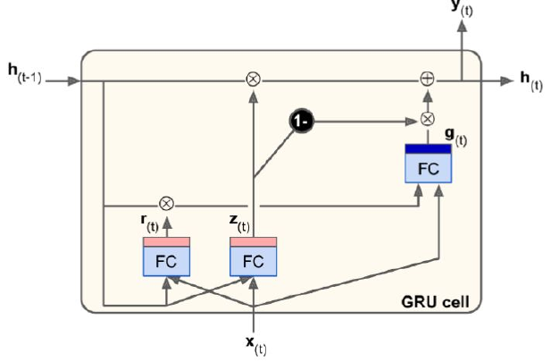

---

## 16. Natural Language processing with RNNs and attention (**Transformers**)

### Natural Language Preprocessing (NLP)

ML technique that uses text as input and/or output.

Different approaches:

- Traditional: feature extraction + ML model
- RNN
- Transformer based

#### Basic textual feature extraction

- ML algos typically require numeric input data
- N-grams: often, words are kept into sequences of N-words. For example the bi-grams of the sentence "This is a sentence" becomes: `["This is", "is a", "a sentence"]`
- Large vocab -> sparse inputs
- Text vectorization: convert each document to a vector of numerical features

$$w_{x,y} = tf_{x,y} . \log(\frac{N}{df_{x}})$$

- `w`:  weight
- `tf`: freq of word
- `N`: number of documents
- `df`: number of documents where word occures

### RNNs for text generation (seq2seq)

- Pass a single input character at a time and predict the next character in the sequence.
- At inference time, we predict one char at a time passing the previous output as input
- *Unsupervised pretraining*: The text encodings learned by the model can be useful for other tasks like sentiment analysis.


### RNNs for text classification (seq2vec)

Classification of text could be sentiment analysis. For the purpose of classification, it's best to pass the entire sentence as input. Every word gets assigned a unique ID, and only the N most frequent words get used to classify. The network typically has one *embedding layer* that serves as a lookup table that converts every word to a learned vector representation. The vector representation usually conveys how close certain words are to each other.

### Neural machine translation (encoder-decoder)

- Encoder receives input sentence, one word at a time
- Decoder receives encoder state and correct previous output word


#### Bidirectional RNN

The representation of a word typically depends on both the previous and the next word. That's why a second RNN gets added that reads the sentence backwards. Then, concatenate the two states of the encoder RNNs before passing it to the decoder.

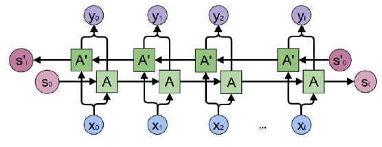

#### Beam search

Keep track of the `k` most likely potential output sentences. Try to extend all of these sentences with one additional word.

### Attention mechanisms

The encoder-decoder architecture struggles with long sentences because all the info needs to be encoded in the state. To solve this issue, an attention mechanism gets used.

The attention mechanism keeps track of info related to all words in the input sentence and allow the decoder to selectively attend to parts of the input.

- We store the encoder's output while preprocessing the input
- At each timestep, the decoder receives a weighted sum of those outputs as input.
- Weights are predicted by an alignment model based on the decoder's current state and encoder outputs.

#### Multi-head attention

For each word in the input sentence, the attention applies a linear layer to obtain three tensors: key, value, query.

It then calculates the similarity between the word's query vec with all other key vecs. These similarities are used to calculate a weighted average. This is repeated a couple of times to allow the model to extract different types of relationships between input tokens.

### Transformers

An architecture that does not make use of RNN or CNN, just fully connected layers + attention. It does not suffer from vanishing gradient and is better at capturing long-range patterns.

1. The sentence is split word by word
2. Each word is replaced by a learnable embedding
3. The sentence is then represented by a 3D tensor
4. Tensor is transformed while going through the model but the dimensions remain the same

The encoder transforms every input word into a high level representation that captures the meaning of that word in this specific sentence.
While the decoder transforms the embedding of a translated word into the embedding of the next translated word based on the information extracted by the encoder.


### GPT

- Generative pretrained transformer
  - Pretrained: predict the next token in the sentence
  - Finetuning: set of different task (summarization, text classification or sentiment analysis)
- Previous models used supervised learning (e.g. translation) but labeled datasets are expensive to collect

### Vision transformer

Transformers can also be used for image classification (e.g. ConvNet)

---

