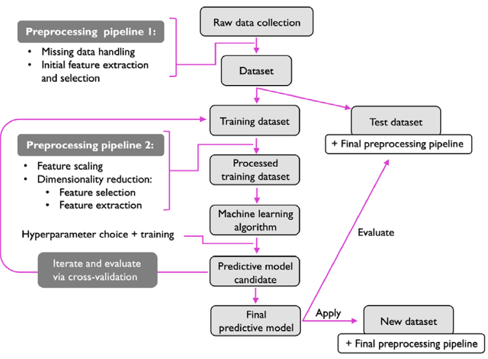
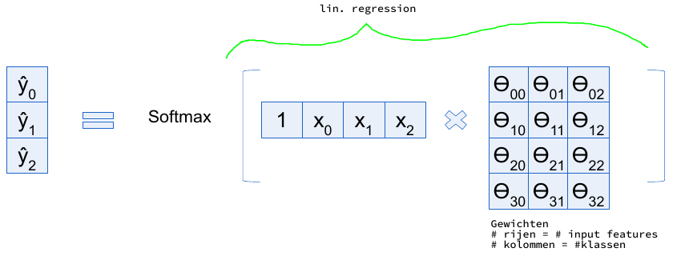

# Machine Learning summary

## 1. The ML landscape

### ML types

| Supervised                             | Unsupervised                   | Reinforcement           |
| -------------------------------------- | ------------------------------ | ----------------------- |
| Labeled data                           | No labels                      | Decision process        |
| Direct feedback                        | No feedback                    | Reward system           |
| Predict outcome/future                 | Find hidden structures in data | Learn series of actions |
| eg: Classification or regression[^1] | eg: Anomaly detection          | eg: alphago             |

[^1]: Regression = predict a target value from sample's feature

### Model based vs instance based learning

| Model-based                                             | Instance-based                                                     |
| ------------------------------------------------------- | ------------------------------------------------------------------ |
| Evaluate a mathematical function on the unseen instance | Measure similarities between unseen instance and training instance |

### Training a model

1. Choose a parameterized model family ($\text{life satisfaction} = \theta_{0} + \theta_{1} \cdot \text{GDP_per_capita}$)
2. Find parameter values that maximize a fitness function or minimize a cost function

**No free lunch**
: There is no model that is guaranteed to work better, a lot of testing must happen to choose and fine-tune the model.

#### Testing and validation


#### Overfitting

Model doesn't generalize enough. It learns your specific training data but underperforms on new data.

Possible cures:

- Use a bigger dataset
- Simplify model
- Reduce the noice in the dataset

#### Underfitting

When the performance is even bad on the training data

Possible cures:

- Increase number of parameters
- Add more features
- Reduce the regularization parameters

### ML workflow


### Problems with bad datasets

**Sampling bias**: Dataset can be non-representative if it has an underrepresented classes.

Garbage in == Garbage out: Bad dataset is guaranteed to lead to a bad (trained) model.

## 2. End-to-end ML project

### Workflow



### Exploratory Data Analysis (EDA)

1. Get an initial feel of the data
1. Visualize and gain insight
1. Prepare the data

#### What to do with missing values

- Remove entry
- **Imputation**: replace by mean, median, 0, ...

#### Categorical attributes

Attributes that can only take a limited number of values (eg: T-shirt sizes)

**one-hot-encoding**: Use on categorical variables to transform them into a format the model can understand.

#### Features scaling

Some extremely big or small features may have an abnormally large impact on the model.
This can be solved by _rescaling_ them using the following techniques:

- **Normalization** (min-max scaling): $x_{norm} = \frac{x - min(x)}{max(x) - min(x)}$
- **Standardization**: $x_{stand} = \frac{x - mean(x)}{standarddeviation(x)}$

## 3. Classification

Classification always happens by _supervised learning_ models

### Performance Metrics

#### Accuracy

**Accuracy**
: The percentage of predicted labels that corresponds with the ground truth label.

$Accuracy = \frac{TP + TN}{Total}$

#### Confusion Matrix

Columns are predicted labels, rows are true labels

|               | Automobile     | No Automobile  |
| ------------- | -------------- | -------------- |
| Automobile    | True Positive  | False Negative |
| No Automobile | False Positive | True Negative  |

#### Precision and recall

**Precision**
: Accuracy of the positive predictions: $precision = \frac{TP}{TP+FP}$

Recall
: How many of the actual positives are detected?: $recall = \frac{TP}{TP+FN}$

**When do we want high precision?**

- When false positives are costly (eg: medical predictions, fraud detection). You really don't want falsely flag a condition.
- In imbalanced datasets where the majority class is the negative one.

**When do we want high accuracy?**

- False negatives are costly (eg: cancer detection or nsfw filters)
- Information retrieval: recall helps ensure that all relevant documents or information are retrieved

#### F1 score

It combines the precision and recall of a model into a single metric.

$F_{1} = 2 . \frac{precision \cdot recall}{precision + recall}$

### Binary Classification

**Binary**
: Only two classes.

- **Decision boundary**: hypersurface that partitions underlying vector space into two sets, one for each class.
- **Score/Class Probability**: $\hat{y}(x^{(i)}) = \begin{cases} +1 \quad \text{if}\quad h_{\theta}(x^{(i)}) \geq T \\ -1 \quad \text{if}\quad h_{\theta}(x^{(i)}) < T \end{cases}$   (T = threshold as hyperparam)

#### Choosing a threshold

##### Precision vs Recall (Choosing a threshold)


##### ROC curve and Area Under The Curve (AUC)


### Multiclass classification

#### One-vs-Rest

Turn multiclass into binary classification (eg: classes [green, blue, red] -> one-vs-rest: [green, rest[blue, red]])

- Classification based on voting
- NumClass * (NumClass – 1)/2 classifiers to train

## 4. Training models

### Linear regression

- **Assumption** (Inductive bias): There is a linear relationship between the input features and the target.
- $Price = \theta_{0} + Bedrooms * \theta_{1}$
  - $\theta_{0}$ : intercept Bias
  - $\theta_{1}$ : slope weight
- Goal: find optimal parameter that defines line that best fits the data
- The prediction is the weighted sum of the input features with an additional bias
- $\hat{y} = h_{\theta}(x) = \theta \cdot x$
  - $\hat{y}: prediction$
  - x: input features, extended with a “1” value (as bias)
  - $\theta$: model parameters


#### Linear regression training

- Minimize some loss function that measures how good $\theta$ is (Root Mean Square Error): $RMSE = \sqrt{\sum_{i=1}^{n} \frac{(\hat{y}_{i} - y_{i})^2}{n}}$
- Multiple options to find $\hat{\theta}$
  - Direct “closed form” solution
  - Gradient descent
    - Batch
    - Mini-batch
    - Stochastic

#### Direct solution

- Directly calculate the optimal parameter given a labelled dataset (rare)
- Like generating a trendline in excel
- **Ordinary least squares**
  1. Calculate the partial derivatives of the loss function with respect to the parameters ($\Theta_{0}, \Theta_{1}$)
  2. Set derivatives to zero
  3. Solve the set of equations
- Relies on matrix inversion: $O(n^{3})$


#### Gradient descent

**Gradient descent**
: It is a first-order iterative algorithm for finding a local minimum of a differentiable multivariate function.

- Generic optimization algorithm
- Procedure:
  1. Calculate the partial derivatives of the Loss function with respect to the parameters ($\Theta_{0}, \Theta_{1}$)
  2. Pick random values for ($\Theta_{0}, \Theta_{1}$) and evaluate the partial derivative function. These describe how the loss function changes when you change ($\Theta_{0}, \Theta_{1}$)
  3. Adjust ($\Theta_{0}, \Theta_{1}$) in opposite directions of the gradient
  4. Repeat until convergence
- **Learning rate** determines step size

> Convex vs non-convex optimization problem  
> **Convex**: There is no *local minimum*, only one *global minimum*. Gradient descent guaranteed to find minimum.  
> **Non-convex**: There are *local minima*, meaning that model can easily get stuck on bad model.  


##### Batch Gradient descent

Combination of Batch and Stochastic

Calculate the gradient using all available training data before performing a step

- ✅ You use all data -> great model
- ❌ Very slow for small datasets

##### Stochastic Gradient descent

Loop over all training data, calculate the gradient and take a step for each sample

- ✅ Fast
- ✅ Only uses memory for single sample instead of entire dataset
- ❌ Gradient estimate will be noisy
  - unlikely to find optimal solution
  - randomness might help to escape local minima

##### Mini-batch Gradient descent

Combination of Batch and Stochastic

### Polynomial regression

If the relationship is not linear. (eg: temperature and sales of ice cream. Hot days mean lots of sales, but too hot and eating ice cream becomes inconvenient)

- Fit on non-linear model: $y = f(x) = \Theta_{0} + \Theta_{1}x + \Theta_{2} x^{2}$
- Find ($\Theta_{0}$, $\Theta_{1}$, $\Theta_{2}$) with gradient descent
- Transform data to space where it can be solved with linear model

### Model regularization

There are 3 kinds of **generalization** (make useful predictions on unseen data) errors:

**Bias error**
: Mistakes because of wrong assumptions when designing the model = *underfitting* (eg: assuming linear relations)

**Variance error**
: Mistakes made because the model is very sensitive to small variations in the input = *overfitting*

**Irreducible error**
: Noise in the data

How to regularize a model:

- Limit the models expressive power -> less overfitting -> better generalization
- Add regularization term that forces weights to be small
- **Ridge regression**: Tries to approach a loss of 0
- **Lasso regression**: Tries to reach a loss of 0 (-> **Sparse model**)
- **Elastic net**: Weighted sum of Ridge and LASSO

### Cross validation

If there is too little data to afford splitting into test/train/val, you can reuse a lot of data using cross-validation

1. Split data into K equal folds (K=5 or K=10)
2. Train using folds 1-9
3. Test using fold 10
4. Repeat 10 times with other folds as test set
5. Report average accuracy and standard deviation

- ✅: All data will be used for evaluation
- ❌: Computationally expensive

### Hyper parameter optimization

Automated procedures to find good hyper parameters:

- **Grid search**: From each hyper param, combine some values.
- **Random search**: Randomize hyper prarams

> ⚠️ : Optimizing hyper params is also a form of *overfitting*!

Best practice:

1. Split off test set and do not touch it!
2. Develop your model, optimizing hyper parameters with Random search in combination with cross-validation
3. Retrain your model on all training data using the best hyper parameters
4. Evaluate model on test data

### Classification

Why not use linear regression for classification?

Regression models predict an exact value. Gradient descent will change wights to adjust to latest train data, introducing errors for other data.

#### Logistic and Softmax regression

> ⚠️ : Despite the name, Logistic and Softmax are not regression models

##### Logistic regression

- $\hat{p} = \sigma(0.25 * X_{1} + 0.125 * X_{2} - 1)$
- in general: $\hat{p} = h_{\theta}(x) = \sigma(x^{T} \theta)$
- With $\sigma$ = sigmoid function: $\sigma(t) = \frac{1}{1 + \exp(-t)}$
  - \>0.5 if input is positive
  - <0.5 if input is negative
- p close to 0 or 1: data lies far from decision boundary
- p close to 0.5: data close to decision boundary


Training logistic regression

1. Goal: find optimal parameters $\hat{\theta}$ that defines line that best separates the data.
2. Optimize a cost function
3. Use **Log loss**
4. Train using gradient descent with partial derivatives

##### Softmax regression

- For if there is more than one class
- Predict a probability for each class and normalize them to sum to one using the Softmax
- The model is then trained using gradient descent with the cross entropy loss



## 5. Super Vector Machines: Linear classification

- Objective: Learn discriminating function g(x) that separates samples of two categories.
- Inductive Bias: g(x) is linear in its features (line in 3D, plane in 3D)
  - $g(x) = w_{1}x_{1} + w_{2}x_{2} + b = w \cdot x + b = w^{T}x + b$
    - b = bias term
    - w = direction of discriminating function
  - Decision rule:
    - $w^{T}x + b \geq 0$ -> Sample belongs to class 1
    - $w^{T}x + b < 0$ -> Sample belongs to class 2


### Largest margin classifier

Update decision rule to include margin:

- $g(x) = w^{T}x + b \geq 1$ -> Sample belongs to class 1
- $g(x) = w^{T}x + b \leq -1$ -> Sample belongs to class 2
- Width of street becomes: $\frac{2}{\lVert w \lVert}$
- Margin functions:
  - $g(x_{+}) = w^{T}x_{+} + b = 1$
  - $g(x_{-}) = w^{T}x_{-} + b = -1$

To maximize the street width, we need to minimize $\lVert w \lVert$. For math convenience, we will minimize $\frac{1}{2} \lVert w \lVert ^{2}$


#### Importance of standardization before margin classification

When not standardized, the distance calculation is dominated by the feature with the largest scale, therefor it is necessary to scale/standardize all values using the following formula:
$x_{0, scaled} = \frac{x_{0} - \mu_{x_{0}}}{\sigma_{x_{0}}}$

### Soft margin classification

Allows for:
- misclassification (can deal with outliers)
- items in the margin

Tolerates some errors: $\zeta^{(i)} \geq 0$

$g(x^{i}) = t^{(i)}(w^{T}x^{(i)} + b) \geq 1 - \zeta^{(i)}$


### Hard margin vs soft margin

| Hard          | Soft          |
|---------------| ------------- |
| small margin  | bigger margin |
| more accurate | less accurate |

### Solving SVM's

$w = \sum_{i=1}^{n} \alpha^{(i)}\,t^{(i)}\,x^{(i)} = \sum_{x^{(i)}} \alpha^{(i)}\,t^{(i)}\,x^{(i)} + \sum_{x^{(i)}} C\,t^{(i)}\,x^{(i)}$

Meaning: w = on the margin + in-margin or misclassified

- $\alpha^{(i)} = 0$: if $x^{(i)}$ is on the correct side of the boundary and outside margin
- $\alpha^{(i)} = C$: if $x^{(i)}$ is on the wrong side of the boundary or within the margin
- $0 < \alpha^{(i)} < C$: if $x^{(i)}$ is exactly on the margin

### SVM for non-linear classification

Example of non-linear data


#### The kernel trick 

It is possible to project data to higher dimension, and solve using linear classification.

> ❗: Due to hidden constants, the complexity of the solver scales badly with the number of features, so the generalized Lagrangian is no longer that efficient.

## 6. Decision Trees

Break down a decision on a sequence of smaller decisions, each based on a single feature.

Example:

```text
X1 = Age
X2 = Sex
X3 = Cholesterol

Y = Patient has heart disease

-> Age > 60?
        ├ yes -> Cholesterol > 300?
        │                ├ yes  -> Y = 1
        │                └ No   -> Y = 0
        └ No -> Sex = Male?
                         ├ yes  -> ...
                         └ No   -> Y = 0
```

### Decision trees for classification vs regression

| Classification                                             | Regression                                              |
|------------------------------------------------------------|---------------------------------------------------------|
| Predict class members                                      |  Predict continuous value                               |
| Leaves store class probabilities                           | Leaves store values                                     |
| Internal nodes define a split of the remaining data points | All items in the smae subspace have the same prediction |

### Building a decision tree

1. Given a dataset with features X and labels Y, split data in two by asking questions
2. Question = compare one feature with a threshold
3. Iteratively split two subsets again by asking another question
4. Repeat until no data left or tree has certain hight

### CART (classification and regression trees) algorithm

> ❗: High probability for a practical question on the exam!

1. Loop over all features
2. Pick a threshold
3. Split data points in two based on this threshold
4. Measure hog good split is with a **cost function**
5. Pick best split
6. Repeat until split is empty or until tree height is reached

Cost function: $J(k, t_{k}) = \frac{m_{left}}{m}\,G_{left} + \frac{m_{right}}{m}\,G_{right}$

* G = cost (Gini impurity)
* k = different classes
* $t_{k}$ = Node
* m = total number of instances in a node before the split

Gini impurity = $1-\sum_{i=1}^{C}(p_{i})^{2}$

* C = number of classes
* $p_{i}$ = fraction of data points that belong to class C in the subset


#### Entropy

Instead of the *Gini impurity* we can also use Entropy

**Entropy**
: Average level of "information", inherent to the variable's possible outcome

In decision tree, entropy is zero if a particular node only contains samples of a single class.


### Regularization

Decision trees, too, can overfit. Therefor regularization is important. It limits the freedom of:

- Min_samples_leaf
- Min_weight_fraction_leaf
- Max_height
_ Max_leaf_node


### Are decision trees any good?

- ✅: Easy to understand
- ✅: Can model non-linear data
- ✅: Whitebox model (eg: useful for medical prediction to know what influenced the diagnosis prediction)
- ✅: Easy to implement
- ✅: Allows to determine feature importance
- ✅: Supports multiple outputs
- ❌: Unstable (small change in data an drastically change model)
- ❌: All decisions are made by orthogonal decision boundaries (only straight lines perpendicular to feature axis)
- ❌: Relatively inaccurate
- ❌: Prone to overfitting


